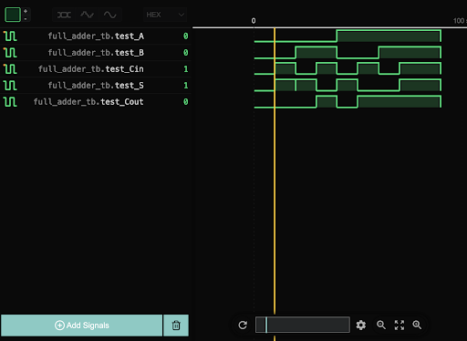

# Project: 01-Full-Adder

## 1. Overview

This module implements a single-bit full adder. It takes three inputs (A, B, Cin) and produces two outputs (Sum, Cout). Its purpose is to serve as the fundamental building block for the Arithmetic Logic Unit (ALU).

## 2. Logic Implementation

The logic is implemented using continuous assignments (`assign`). The boolean formulas used are:

- `Sum = A ^ B ^ Cin;`
- `Cout = (A & B) | (Cin & (A ^ B));`

## 3. Verification

A testbench (`full_adder_tb.v`) was created to verify the module's functionality. The testbench systematically checks all 8 possible input combinations (from 3'b000 to 3'b111), applying a new vector every 10 time units.

The resulting waveform, visualized using WaveTrace in VS Code, confirmed that the logic is correct for all test cases.

## 4. Challenges & Learnings

- **Challenge:** I initially forgot to add the `#10` time delays between test vectors in the testbench. This caused the simulation to execute all assignments at time 0, and the waveform only showed the final state (111).

- **Learning:** This experience highlighted that time progression is a critical component of a testbench. Without explicit delays, intermediate states are not observable in the waveform, making verification impossible.